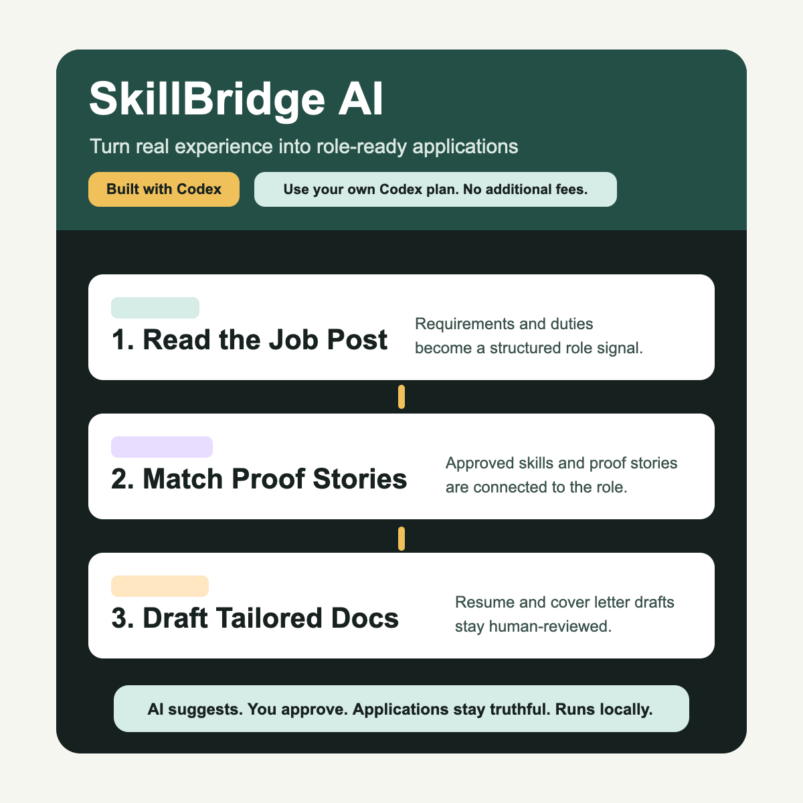
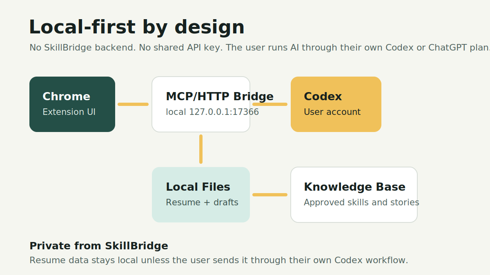
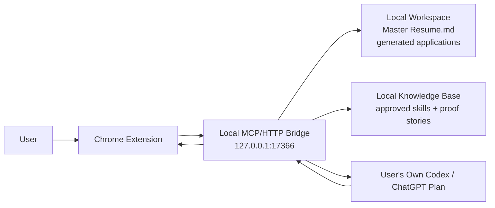
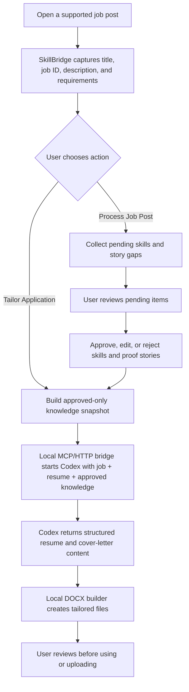
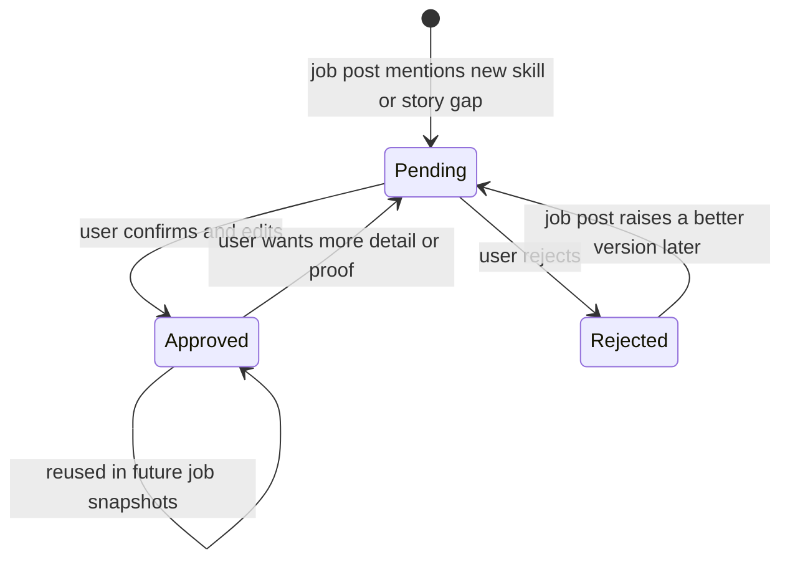
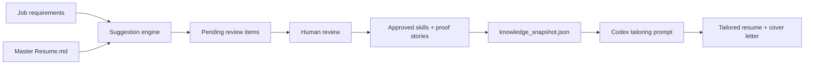

# SkillBridge AI

SkillBridge AI is a Chrome extension and local MCP/HTTP bridge that helps students translate real experience into role-ready applications.

The project was inspired by recruiter advice: technical, founder, teaching, support, and project experience can often transfer into many different roles, but students need help remembering the right stories and translating them honestly.

SkillBridge AI reads a job posting, identifies the role requirements, maps them to approved skills and experience stories, and uses Codex to draft tailored resume and cover letter documents. The user stays in control of what is true, what gets approved, and what gets submitted.

Project page: [https://beycoder.github.io/skillbridge-ai/](https://beycoder.github.io/skillbridge-ai/)

GitHub repo: [https://github.com/BeyCoder/skillbridge-ai](https://github.com/BeyCoder/skillbridge-ai)

Install guide: [INSTALL_WITH_CODEX.md](INSTALL_WITH_CODEX.md)



## Why The Architecture Matters

SkillBridge AI is local-first. There is no central SkillBridge backend and no shared API key. Each user runs the Chrome extension, local MCP/HTTP bridge, and Codex workflow on their own machine using their own Codex or ChatGPT plan. No additional fees.

That keeps the project accessible: users do not need to pay the project maintainer, and the maintainer does not need to host a paid AI service. It also means no SkillBridge server sees the user's resume, job applications, generated documents, logs, or skill/story knowledge.

When Codex drafts materials, the job posting, resume content, and approved knowledge needed for that draft are handled through the user's own Codex/ChatGPT account and plan.





## Core Workflow

- Tailor Application: reads the current supported job page, extracts the `JR...` job ID, sends the description and requirements to the local MCP/HTTP bridge, and starts Codex.
- Autofill: on supported application upload, experience, skills, questions, or disclosure steps, finds the matching local `JR...` job, uploads missing tailored documents, fills skills from the tailored resume, answers saved eligibility fields, and repairs narrow parser mistakes by comparing the page against the generated resume.
- Process Job Post: reads the current job page, stores the description and qualifications locally, and updates the skills/story knowledge database with pending review items without generating application documents.
- Review Skills & Stories: opens the profile page where the user can approve, reject, add, or edit the global skills and experience-story database.



## Local Storage

Each tailored job is stored by job ID:

`generated-applications-v2/JR12345/`

Codex creates only:

- tailored resume DOCX
- tailored cover letter DOCX

The local MCP/HTTP bridge owns internal tracking files such as `status.json` and `progress.jsonl`. The extension treats both DOCX files existing as the readiness gate.

## Skills & Experience Knowledge

The local MCP/HTTP bridge keeps a global user-approved knowledge database at:

`generated-applications-v2/profile_knowledge_base.json`

The database has:

- `skills`: keyword-style skills for matching job descriptions.
- `experiences`: proof stories that explain how a skill was used in real work.

When the user tailors a job or clicks `Process Job Post`, the local MCP/HTTP bridge scans the job description and qualifications for skills and experience areas that are not approved yet. It adds them as `pending` review items, never as approved facts. Codex receives an approved-only snapshot for each job in `knowledge_snapshot.json`, so pending suggestions are treated as gaps to review rather than claims to put in the resume.





Experience story cards include an `AI Draft` helper:

- If the story box has rough notes, AI turns those notes into editable proof-style use-cases.
- If the story box is empty, AI suggests several use-cases grounded in the master resume or approved knowledge, with evidence and details the user should confirm.
- AI clarification questions are shown in a follow-up panel so the saved story stays clean.
- AI output is never approved automatically. The user edits the text and clicks `Approve` or `Save`.

## Start The Bridge

From this folder:

```sh
node bridge/mcp-http-bridge.js
```

The local MCP/HTTP bridge listens on `http://127.0.0.1:17366`.

For a guided setup prompt, see [INSTALL_WITH_CODEX.md](INSTALL_WITH_CODEX.md).

## License

SkillBridge AI is source-available, not open source.

It is licensed under the [PolyForm Strict License 1.0.0](LICENSE.md). Personal and noncommercial use is allowed. Commercial use, redistribution, sublicensing, and modified versions require prior written permission from the copyright holder.

See [COMMERCIAL_USE.md](COMMERCIAL_USE.md) for the plain-language permission policy.

## Submission Framing

SkillBridge AI is not an auto-apply bot. It is a human-reviewed career translation assistant.

The goal is to make real experience visible by helping the user:

- Remember relevant proof stories.
- Translate transferable skills across roles.
- Tailor application materials to a specific job.
- Keep uncertain or unsupported claims out of the final documents.
- Use Codex as a drafting and reasoning partner while preserving human review.
